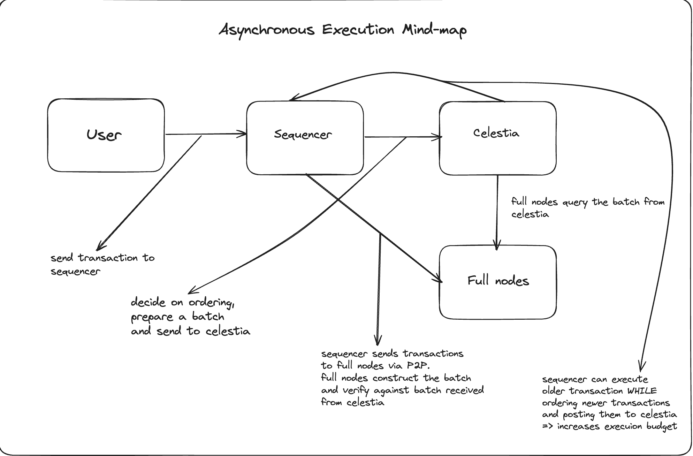

# Asynchronous Execution

In this section, we will discuss one of the major upgrades coming to Spicenet -- Asynchronous Execution. The concept of asynchronous execution has largely been made popular by L1s like Monad and Solana, which either already have it implemented in protocol(Monad), or have been discussing implementing it(Solana). But, what is Asynchronous Execution exactly? Broadly, it refers to decoupling of the transaction flow, and removing the strict restrictions of what process has to occur after what, etc. The process in this case is execution. Most L1s have enforced nodes to re-execute transactions for every block, restricting execution capacity of a node to that of a block.&#x20;

Asynchronous Execution proposes that nodes are to come in consensus first, without the need of executing the transactions first. This is fine because execution is deterministic, while consensus is not. What does this mean? This means that the result of executing a set of transactions, provided ordering integrity is maintained, is always the same.&#x20;

## The problem with current L2s

Current Layer 2s rely on executing transactions and preparing a block/batch(depending on the type of L2. OP Mainnet gives block-level pre-confirmation, while Arbitrum One gives batch-level pre-confirmation) before giving a pre-confirmation. This adds a significant overhead of making commitments to the Ethereum Merkle Patricia Trie. The second limitation is that execution is strictly coupled into the transaction flow, limiting the execution budget of the sequencer to the current set of transactions.&#x20;

The third fundamental issue is regarding over-delivering of the pre-confirmation. Most L2s today give something called as an "inclusion" pre-confirmation, wherein the promise is limited to only inclusion of the transaction. This means that execution, or the state transition resulting after the transaction, is not part of the promise, although transactions need to be executed at some point in time, in order to have up-to-date state. This also means that nothing in the pre-confirmation logic today stops the central sequencer from executing transactions asynchronously, as it does not break the promise.

## Why does Asynchronous Execution make sense?

Asynchronous Execution alters the typical transaction flow of a rollup, making it much more simplified and eliminating latencies introduced due to executing transactions and committing to state. The new transaction flow looks somewhat like this:

<figure><figcaption>
Transaction flow when execution is pipelined with batching.
</figcaption></figure>

What does this mean? This means that the sequencer can execute older transactions _while_ ordering and batching newer transactions. This can also be said as execution is pipelined with batching. Instead of the sequencer executing every transaction, it directly prepares a batch and posts it to Celestia, and parallely broadcasts it to full nodes via P2P. Full nodes create a batch from the received transactions and compare it with the batch received from Celestia, in order to ensure integrity. The magic lies in the step wherein the sequencer also consumes the batch from Celestia. This means that the sequencer can execute older transactions by downloading the batch from Celestia, _while_ ordering and batching newer transactions, hence the statement, "pipelining execution and batching".

This introduces immense scalability benefits, as the sequencer does not have to execute every transaction instantly, and can do so at a future date. Moreover, the ability to execute older transactions while batching newer ones was not possible before, and massively increases the execution budget of the sequencer.

## Challenges with Asynchronous Execution

Here, we will discuss the problems and challenges induced by Asynchronous Execution and the potential solutions we are exploring for the same.&#x20;

The first problem is that of "resource pricing"(as famously said by John Adler -- "it's all about resource pricing"). The problem is that invalid transactions do not immediately pay full gas because transactions are not executed instantly, and hence resources cannot be accurately priced at that point of time. This leads to imbalance between compute consumed and fees paid, wherein many invalid transactions can be sent to the network, but appropriate fees for it are not paid.

However, this problem can be mitigated by introducing gas fees only for conducting pre-flight checks. For example, these checks may include valid signature checks, account balance checks, etc. This means that even if someone were to spam the network with invalid transactions, they would have to pay the proper price for doing so. We are still considering whether such fees are to be multi-dimensional.

The second problem is that because the sequencer does not post merkle roots with the batch, the result of the batch to the state is arbitrary. Hence, this can be used by malicious full nodes to use arbitrary execution rules to produce an incorrect root. We are still finalizing on a mechanism to tackle such issues. Some of the mechanisms we have thought of are using light nodes to verify roots produced by the full nodes and the sequencer, by allowing them to verify merkle proofs produced by nodes and thus attest to the validity of the correct root, and penalize nodes that produce incorrect proofs.
